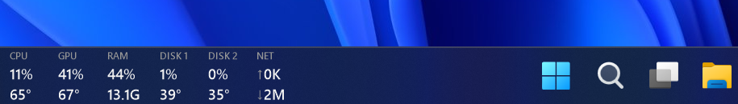
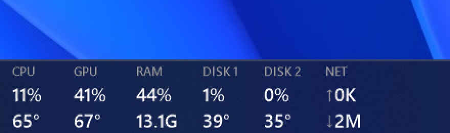

# TaskbarMonitor

[](https://github.com/MarllonGomes/TaskbarMonitor/actions/workflows/build.yml)
[](https://github.com/MarllonGomes/TaskbarMonitor/releases/latest)
[](LICENSE)

A minimalist hardware monitor that lives in the **left corner of the Windows 11
taskbar**, on **every screen**. No window, no dock, no skin — just numbers drawn
straight over the taskbar, updated every second:



<p align="center">
  
</p>

One column per device — header on top, load on the first line, temperature on
the second (for NET: upload ↑ and download ↓). Adding a device is just adding
a column.

| Column | What it shows |
|---|---|
| **CPU** | Total load + temperature (Tctl/Tdie on AMD, Package on Intel) |
| **GPU** | Load + temperature (prefers the discrete GPU; iGPUs use D3D counters) |
| **RAM** | Usage percentage + used GB (tooltip shows used/total) |
| **DISK 1 / DISK 2** | Per-drive activity + temperature (up to two drives in the bar, all of them in the tooltip; NVMe uses the composite sensor, not the hotspot) |
| **NET** | Upload (↑) / download (↓), sum of all interfaces (`K` = KB/s, `M` = MB/s) |

## Features

- **Native look** — transparent background, text rendered directly over the
  taskbar; follows the Windows light/dark theme automatically.
- **Stable column grid** — one column per device, widths sized for worst-case
  values, so numbers never shift around as digits change.
- **Color-coded alerts** — values turn yellow (≥ 70 °C / ≥ 85% load) and red
  (≥ 85 °C / ≥ 95% load).
- **Multi-monitor** — one overlay per screen, pinned to that screen's taskbar
  (`Shell_TrayWnd` / `Shell_SecondaryTrayWnd`), with per-monitor DPI support.
  Monitors can be plugged/unplugged at runtime.
- **Fullscreen aware** — the overlay hides on a screen while a game or
  fullscreen video covers it (checked per screen, not just the focused window)
  and comes back automatically. Click-through overlays (e.g. NVIDIA's) are
  ignored. Also hides while the taskbar auto-hides.
- **Never steals focus** — the overlay window is non-activating; hover for a
  detailed tooltip, right-click for the menu.
- **Runs at startup** — via a Scheduled Task (at logon, elevated, no execution
  time limit), created by `install.ps1` or from the tray menu.
- **Lightweight** — a single small .NET 8 process; sensors are read once per
  second on a background thread via LibreHardwareMonitor.

## Installation

### Installer (recommended)

Download **`TaskbarMonitor-Setup-<version>.exe`** from
[Releases](https://github.com/MarllonGomes/TaskbarMonitor/releases/latest) and
run it — that's all. No .NET runtime required. The installer:

- installs to `Program Files\TaskbarMonitor` and adds a Start Menu entry;
- registers the elevated startup task, so temperatures work out of the box
  and the monitor starts at every logon;
- starts the monitor immediately, and installs updates right over the
  previous version.

Uninstall from Windows **Settings → Apps** (removes the startup task too).

### Portable zip

1. Download a zip from [Releases](https://github.com/MarllonGomes/TaskbarMonitor/releases/latest):
   - `TaskbarMonitor-<version>-win-x64.zip` — small, requires the
     [.NET 8 Desktop Runtime](https://dotnet.microsoft.com/download/dotnet/8.0)
   - `TaskbarMonitor-<version>-win-x64-self-contained.zip` — larger, no runtime needed
2. Extract it anywhere.
3. Right-click `install.ps1` → **Run with PowerShell** and accept the UAC prompt once.

> **Why administrator?** LibreHardwareMonitor needs a kernel driver to read CPU
> and disk temperatures. Without elevation the app still works, but those
> temperatures show as `--`. The Scheduled Task created by `install.ps1` runs
> the app elevated at logon *without* any UAC prompt.

### From source

```powershell
git clone https://github.com/MarllonGomes/TaskbarMonitor.git
cd TaskbarMonitor
.\build.ps1     # requires the .NET 8 SDK
.\install.ps1
```

## Usage

- **Hover** the overlay for a detailed tooltip (GPU name, RAM in GB, precise
  network speeds).
- **Right-click** the overlay (or the tray icon) for the menu:
  - *Start with Windows* — toggles the Scheduled Task
  - *Restart as administrator* — shown when running unelevated
  - *Exit*
- Logs (if anything goes wrong): `%AppData%\TaskbarMonitor\error.log`.

## CPU temperature shows `--`?

CPU temperature needs elevation and a kernel driver (LibreHardwareMonitor's).
Check, in order:

1. **Are you running elevated?** Install with the setup installer (it registers
   an elevated startup task). Unelevated, CPU/disk temps show `--`.
2. **Is the sensor driver blocked?** Some security software may flag or block the
   driver (see [SECURITY.md](SECURITY.md)); allow-list the app if so.

Everything else (GPU temp, disk temps, all loads, RAM, network) works regardless.

## Uninstall

Installer users: **Settings → Apps → TaskbarMonitor → Uninstall**.

Portable users: run `uninstall.ps1` (stops the app and deletes the Scheduled
Task), then delete the folder. The app stores nothing else besides
`%AppData%\TaskbarMonitor`.

## Security

TaskbarMonitor runs **elevated at logon** and loads a **kernel driver** to read
temperatures. The security model, the trust involved, and how to report a
vulnerability are documented in [SECURITY.md](SECURITY.md). Release binaries are
unsigned — verify the **SHA-256 checksums** published with each release.

## How it works

Windows 11 rewrote the taskbar as a XAML/DirectComposition surface, which
paints **over** classic child windows — the old trick of `SetParent`-ing a
widget into `Shell_TrayWnd` renders invisibly. TaskbarMonitor instead uses a
**topmost layered window** per screen:

- Per-pixel alpha via `UpdateLayeredWindow` — the background is fully
  transparent (alpha 2, kept non-zero so the window still receives mouse
  input), text is opaque.
- `WS_EX_NOACTIVATE | WS_EX_TOOLWINDOW` — never takes focus, never appears in
  Alt-Tab.
- Every 500 ms the coordinator re-pins each overlay to its taskbar, re-asserts
  topmost, and scans visible top-level windows to detect fullscreen apps
  per screen (excluding shell windows, cloaked UWP ghosts and click-through
  overlays).

Sensor data comes from
[LibreHardwareMonitor](https://github.com/LibreHardwareMonitor/LibreHardwareMonitor).

## Project structure

| File | Role |
|---|---|
| [`MonitorAppContext.cs`](MonitorAppContext.cs) | Coordinator: per-screen overlays, fullscreen detection, theme, tray menu |
| [`OverlayForm.cs`](OverlayForm.cs) | Layered rendering, fixed-grid layout |
| [`SensorService.cs`](SensorService.cs) | Sensor polling (LibreHardwareMonitor) |
| [`Autostart.cs`](Autostart.cs) | Scheduled Task management (`schtasks`) |
| [`Win32.cs`](Win32.cs) | P/Invoke (SetWindowPos, UpdateLayeredWindow, EnumWindows, …) |
| [`install.ps1`](install.ps1) / [`uninstall.ps1`](uninstall.ps1) | Autostart install/remove (portable zip) |
| [`installer/`](installer) | Inno Setup installer (`build-installer.ps1` → `TaskbarMonitor-Setup-*.exe`) |

## Requirements

- Windows 11 (works on Windows 10 too)
- .NET 8 Desktop Runtime (or use the self-contained release)
- Administrator rights for CPU/disk temperatures (handled by the install script)

## License

[MIT](LICENSE) — © Marllon Gomes.

Sensor readings powered by
[LibreHardwareMonitor](https://github.com/LibreHardwareMonitor/LibreHardwareMonitor) (MPL 2.0).
