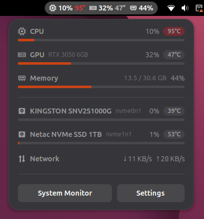

# TaskbarMonitor (Linux)

A minimalist hardware monitor for the Linux top bar — the Linux port of
[TaskbarMonitor](https://github.com/MarllonGomes/TaskbarMonitor). It shows
**CPU, GPU, RAM, disk and network load and temperature**, updated once a
second.

Because the GNOME top bar is much smaller than the Windows taskbar, the GNOME
UI is a **native GNOME Shell extension** designed for that space (in the
spirit of Vitals / TopHat): compact `icon + value` groups in the bar, with the
full breakdown — usage meters, temperature badges, per-disk rows, network
rates — in the popup menu. On other desktops (KDE, XFCE, …) the package falls
back to an **AppIndicator** tray app.

| Top bar | Popup menu |
|---|---|
|  |  |

## What you get

- **Top bar** (configurable): CPU load + temp, GPU load + temp, RAM %, and
  optionally busiest-disk load/temp and network ↓/↑ rates. Temperatures tint
  amber/red when hot; digits are tabular so the bar doesn't wobble.
- **Popup menu**: per-metric rows with accent-colored usage meters,
  temperature pills (grey → amber → red), GPU model name, used/total RAM,
  every physical disk with model + `%util` + temperature, network rates, and
  shortcut buttons for GNOME System Monitor and the extension settings.
- **Settings** (GNOME): choose which groups appear in the bar, toggle
  temperatures, position (left/center/right) and refresh interval (1–10 s).

## Why it's simpler than the Windows build

On Linux every reading comes from **`/proc` and `/sys`** (and `nvidia-smi` for
NVIDIA GPUs), which are world-readable. So this build:

- runs as a **normal user** — no `sudo`, no elevated task;
- loads **no kernel module** — the CPU/disk temperatures that needed the
  WinRing0 driver on Windows are already exposed at `/sys/class/hwmon` and the
  per-device hwmon nodes;
- has essentially **no attack surface** (see [SECURITY.md](SECURITY.md)).

| Column | Source |
|---|---|
| **CPU** | load from `/proc/stat`; temp from `coretemp`/`k10temp` hwmon |
| **GPU** | NVIDIA via `nvidia-smi`; AMD via `gpu_busy_percent` + amdgpu hwmon; Intel temp via drm hwmon |
| **RAM** | `/proc/meminfo` |
| **Disk** | per-device `%util` from `/sys/block/*/stat`; temp from nvme/drivetemp hwmon |
| **Net** | rx/tx byte rates from `/sys/class/net/*/statistics` |

## Install

Download `taskbar-monitor_<version>_all.deb` from the
[Releases](https://github.com/MarllonGomes/TaskbarMonitor/releases) and:

```bash
sudo apt install ./taskbar-monitor_1.0.0_all.deb
```

**GNOME (Ubuntu):** log out and back in once (GNOME Shell scans system
extensions at login), then:

```bash
gnome-extensions enable taskbar-monitor@marllongomes.github.io
```

**KDE / XFCE / other desktops:** the AppIndicator app starts right away and on
every login (toggle from its menu). Remove everything with
`sudo apt remove taskbar-monitor`.

## Build from source

```bash
./build-deb.sh          # produces taskbar-monitor_<version>_all.deb
```

Build needs `dpkg-deb` and `glib-compile-schemas`. The tray app can also run
in place with `python3 src/app.py` (needs `python3-gi`, GTK 3, an
AppIndicator gir).

### Hacking on the GNOME extension

Test in an isolated nested shell without touching your session:

```bash
UUID=taskbar-monitor@marllongomes.github.io
mkdir -p /tmp/tbm-test/data/gnome-shell/extensions /tmp/tbm-test/config
ln -s "$PWD/gnome-extension/$UUID" /tmp/tbm-test/data/gnome-shell/extensions/
glib-compile-schemas "gnome-extension/$UUID/schemas/"
env XDG_DATA_HOME=/tmp/tbm-test/data XDG_CONFIG_HOME=/tmp/tbm-test/config \
  dbus-run-session -- sh -c "
    gsettings set org.gnome.shell enabled-extensions \"['$UUID']\"
    gnome-shell --headless --virtual-monitor 1600x900 --no-x11"
```

## How it works

- **GNOME:** a Shell extension (GJS/ESM, GNOME 45–50). A `GLib` timer samples
  `sensors.js` — a straight port of `src/sensors.py` — and updates the panel
  groups and popup rows. `nvidia-smi` runs as an async subprocess so the
  compositor never blocks. Settings live in GSettings
  (`org.gnome.shell.extensions.taskbar-monitor`).
- **Other desktops:** a PyGObject + GTK 3 + Ayatana AppIndicator app; the
  system autostart entry carries `NotShowIn=GNOME;` so the two UIs never run
  at once. Autostart can be toggled from the tray menu (writes a per-user
  override in `~/.config/autostart`).

## Testing status

Verified on **Ubuntu 26.04 LTS, GNOME Shell 50.1 (Wayland), real hardware**
(Intel `coretemp`, NVIDIA RTX 3050 via `nvidia-smi`, two NVMe drives with
temperatures, Wi-Fi rates): panel groups, popup menu, meters/severity colors,
prefs window, all settings paths, `.deb` install/remove.

Still to verify on other setups:

- [ ] tray icon + label rendering on KDE Plasma (AppIndicator path)
- [ ] AMD / Intel GPU paths
- [ ] SATA (`drivetemp`) disk temperatures

## License

[MIT](LICENSE) — © Marllon Gomes.
